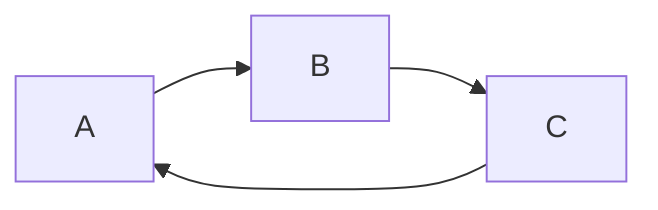
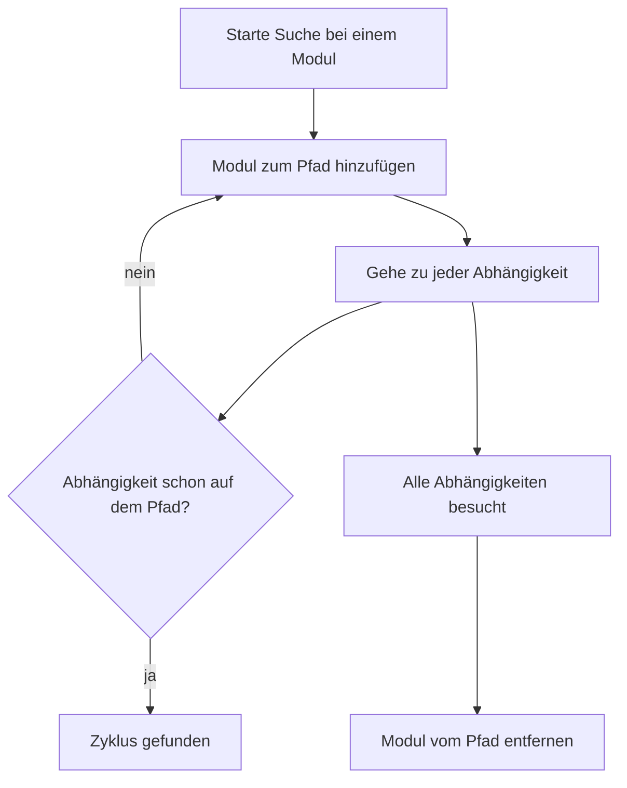
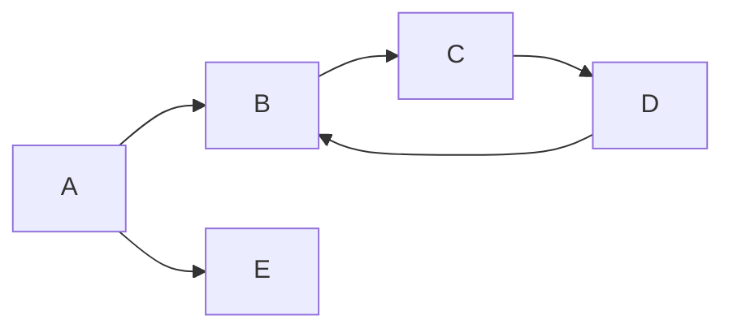

# Zyklus-Erkennung im Modul-Graph

In einem Modul-Graph dürfen keine Zyklen vorkommen. Der Algorithmus dahinter
findet solche Zyklen mit einer Tiefensuche – von der Idee über den Suchzustand
bis zu konkreten Durchläufen.

## Was ist ein Zyklus?

Ein Zyklus entsteht, wenn man über die Abhängigkeiten wandert und **wieder am
Ausgangspunkt ankommt**:

`A → B → C → A` ist ein Zyklus. Ein solcher Graph ist ungültig, weil kein Modul
"zuerst" gestartet werden kann – jedes wartet auf ein anderes.

## Die Idee

**Tiefensuche (DFS)** durch den Graphen. Dabei wird der aktuelle **Pfad**
verfolgt. Trifft man auf ein Modul, das **schon auf dem Pfad** liegt, ist es ein
Zyklus.

## Der Suchzustand

Während der Suche werden vier Dinge mitgeführt:

| Zustand | Zweck |
|---------|-------|
| **Modul-Lookup** | schneller Zugriff auf ein Modul per ID |
| **Besucht** | alle Module, die je besucht wurden – vermeidet doppelte Arbeit |
| **Auf dem Pfad** | Module im **aktuellen** Suchpfad – erkennt Zyklen |
| **Pfad** | der aktuelle Suchpfad **in Reihenfolge** – baut den Zyklus |

### Warum "Auf dem Pfad" und "Pfad"?

Beide enthalten dieselben Module, aber unterschiedlich:

- **"Auf dem Pfad" (Menge `{}`)** → schnelle Prüfung "ist dabei?" → **erkennt** den Zyklus
- **"Pfad" (Liste `[]`)** → Reihenfolge → **baut** den Zyklus (`A -> B -> C -> A`)

**Beispiel:** Bei `A → B → C` ist die Menge `{A, B, C}`, die Liste
`[A, B, C]` (= `1. A → 2. B → 3. C`). Beide sagen "C ist dabei" – nur die
Liste weiß, dass C **nach** B kommt. Diese Reihenfolge braucht die
Rekonstruktion, um aus dem Pfad den Zyklus `A -> B -> C -> A` zu bauen.

### "Besucht" vs. "Auf dem Pfad"

| | Besucht | Auf dem Pfad |
|---|---|---|
| Enthält | alle Module, die **je** besucht wurden | nur Module im **aktuellen** Pfad |
| Wird geleert? | nein | ja (beim Verlassen) |
| Zweck | vermeidet doppelte Arbeit | erkennt Zyklen |

Ein Zyklus liegt **nur** vor, wenn ein Modul im **aktuellen Pfad** wiedergefunden
wird – nicht wenn es nur irgendwann mal besucht wurde.

## Der Algorithmus

1. **Für jedes Modul starten** – jedes Modul als Startpunkt verwenden, alle
   Zyklen sammeln (auch mehrere).
2. **Rekursiv absteigen** – beim Betreten eines Moduls:
   - Schon **auf dem Pfad**? → Zyklus gefunden, rekonstruieren
   - Schon **besucht**? → nichts Neues, zurück
   - Sonst: als besucht markieren, zum Pfad hinzufügen, für jede Abhängigkeit
     rekursiv weiter, beim Verlassen wieder vom Pfad entfernen
3. **Zyklus rekonstruieren** – Pfad ab der Position des wiedergefundenen Moduls
   abschneiden und das Modul am Ende nochmal anhängen.

## Beispiele

Zwei Durchläufe zeigen den Algorithmus in Aktion – zuerst ein einfacher Fall,
dann einer, bei dem die Rekursion sichtbar wird.

### Einfaches Beispiel

Graph: `A → B → C → A` – ein einzelner, geschlossener Zyklus.

| Schritt | Aktion | Pfad | Auf dem Pfad |
|---------|--------|------|--------------|
| 1 | Besuche A | `[A]` | `{A}` |
| 2 | A → B, besuche B | `[A, B]` | `{A, B}` |
| 3 | B → C, besuche C | `[A, B, C]` | `{A, B, C}` |
| 4 | C → A, **A ist auf dem Pfad!** | `[A, B, C]` | `{A, B, C}` |

In Schritt 4 wird der Zyklus rekonstruiert: Pfad ab Position von A (`[A, B, C]`)
plus A am Ende → `[A, B, C, A]`.

Ergebnis: `Cycle detected: A -> B -> C -> A.`

### Komplexeres Beispiel – Rekursion sichtbar

Graph: `A → B → C → D → B` (Zyklus `B → C → D → B`) und `A → E` (Sackgasse).

Die Suche taucht tief ab, findet den Zyklus, **geht zurück** und macht dann mit
der nächsten Abhängigkeit weiter:

| Schritt | Aktion | Pfad | Auf dem Pfad | Besucht |
|---------|--------|------|--------------|---------|
| 1 | Besuche A | `[A]` | `{A}` | `{A}` |
| 2 | A → B, besuche B | `[A, B]` | `{A, B}` | `{A, B}` |
| 3 | B → C, besuche C | `[A, B, C]` | `{A, B, C}` | `{A, B, C}` |
| 4 | C → D, besuche D | `[A, B, C, D]` | `{A, B, C, D}` | `{A, B, C, D}` |
| 5 | D → B, **B ist auf dem Pfad!** | `[A, B, C, D]` | `{A, B, C, D}` | `{A, B, C, D}` |
| 6 | Zyklus rekonstruieren | `[B, C, D, B]` | | `{A, B, C, D}` |
| 7 | Rückweg: D, C, B vom Pfad entfernen | `[A]` | `{A}` | `{A, B, C, D}` |
| 8 | A → E, besuche E | `[A, E]` | `{A, E}` | `{A, B, C, D, E}` |
| 9 | E hat keine Abhängigkeiten, Rückweg | `[A]` | `{A}` | `{A, B, C, D, E}` |

Hier sieht man die **Rekursion**: Die Suche geht bei B tief in `C → D` hinab,
findet dort den Zyklus, und kehrt dann **schrittweise zurück** (D, C, B werden
wieder vom Pfad entfernt), bevor sie mit der nächsten Abhängigkeit von A (`E`)
weitermacht.

Ergebnis: `Cycle detected: B -> C -> D -> B.`
