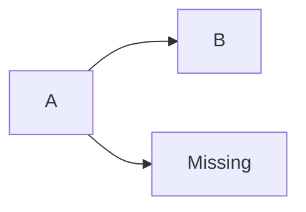
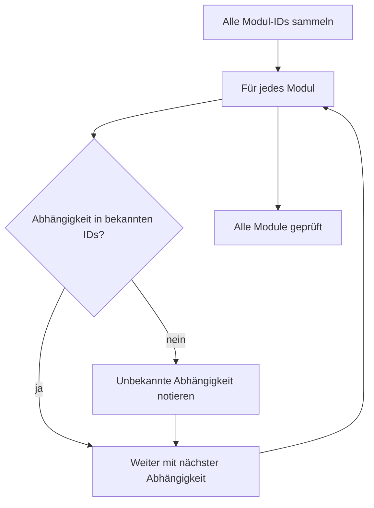
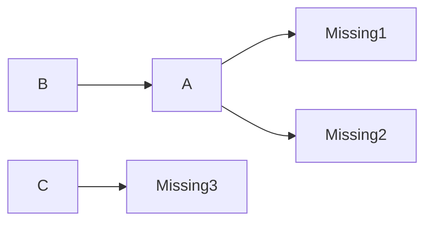

# Erkennung unbekannter Abhängigkeiten im Modul-Graph

In einem Modul-Graph dürfen keine unbekannten Abhängigkeiten vorkommen. Der
Algorithmus dahinter findet solche Abhängigkeiten über die Menge der bekannten
Modul-IDs – von der Idee über den Suchzustand bis zu konkreten Durchläufen.

## Was ist eine unbekannte Abhängigkeit?

Ein Modul darf nur von Modulen abhängen, die es **im Graph auch gibt**. Zeigt
eine Abhängigkeit auf eine ID, die keinem Modul entspricht, ist das eine
**unbekannte Abhängigkeit**:

`A` hängt von `Missing` ab – aber `Missing` existiert nicht. Der Graph ist
ungültig, weil `A` nie ausgeführt werden kann (seine Abhängigkeit fehlt).

## Die Idee

**Alle bekannten Modul-IDs sammeln** und dann für jedes Modul prüfen: Ist jede
Abhängigkeit in dieser Menge? Wenn nicht → unbekannte Abhängigkeit.

## Der Suchzustand

Es wird nur **eine** Sache mitgeführt:

| Zustand | Zweck |
|---------|-------|
| **Bekannte Modul-IDs** | Menge aller existierenden IDs – schnelle Prüfung "gibt es das Modul?" |

## Der Algorithmus

1. **Bekannte IDs sammeln** – alle Modul-IDs in eine Menge `{}` legen.
2. **Für jedes Modul prüfen** – jede Abhängigkeit gegen die Menge testen:
   - **Nicht enthalten** → unbekannte Abhängigkeit notieren (Modul-ID + fehlende ID)
   - **Enthalten** → alles gut, weiter
3. **Ergebnis sammeln** – alle unbekannten Abhängigkeiten als Liste zurückgeben.

## Beispiele

Zwei Durchläufe zeigen den Algorithmus in Aktion – zuerst ein einfacher Fall,
dann einer mit mehreren unbekannten Abhängigkeiten.

### Einfaches Beispiel

Graph: `A → B` und `A → Missing` – eine unbekannte Abhängigkeit.

Bekannte IDs: `{A, B}`

| Schritt | Modul | Abhängigkeit | In bekannten IDs? |
|---------|-------|--------------|-------------------|
| 1 | A | B | ✅ ja |
| 2 | A | Missing | ❌ nein |
| 3 | B | – | – |

Ergebnis: `Module "A" depends on unknown module "Missing".`

### Komplexeres Beispiel – mehrere unbekannte Abhängigkeiten

Graph: `A → Missing1`, `A → Missing2`, `B → A` (bekannt) und `C → Missing3`.

Bekannte IDs: `{A, B, C}`

| Schritt | Modul | Abhängigkeit | In bekannten IDs? |
|---------|-------|--------------|-------------------|
| 1 | A | Missing1 | ❌ nein |
| 2 | A | Missing2 | ❌ nein |
| 3 | B | A | ✅ ja |
| 4 | C | Missing3 | ❌ nein |

Hier sieht man: Ein Modul kann **mehrere** unbekannte Abhängigkeiten haben (A
mit Missing1 und Missing2), und **mehrere Module** können betroffen sein (A und
C). Bekannte Abhängigkeiten (B → A) werden übersprungen.

Ergebnis:
- `Module "A" depends on unknown module "Missing1".`
- `Module "A" depends on unknown module "Missing2".`
- `Module "C" depends on unknown module "Missing3".`
